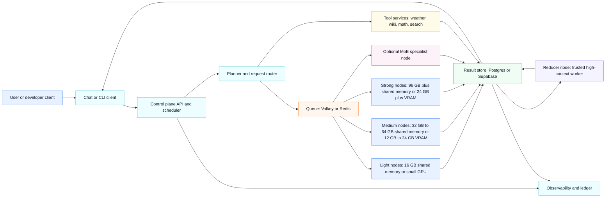
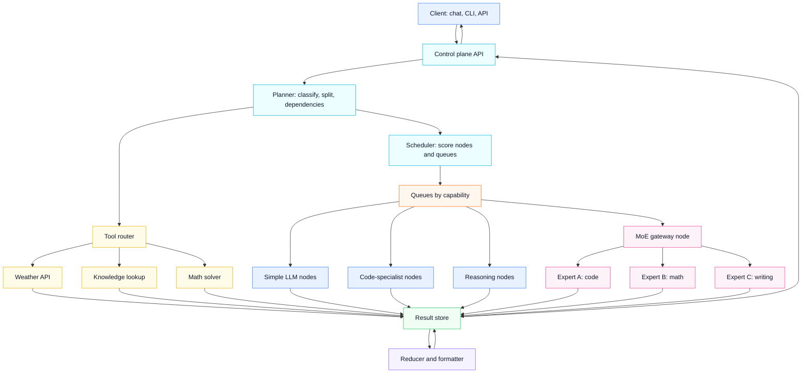

# MundusX Control Plane Business Requirements

## Document Control

| Field | Value |
|---|---|
| Product | MundusX Control Plane |
| Repository | `mundusx/control-plane` |
| Status | Draft |
| Owner | MundusX operators |
| Last updated | 2026-07-03 |

## Purpose

The MundusX control plane provides the company-owned operator surface for coordinating contributed compute nodes, routing inference jobs, tracking execution state, and exposing operational visibility. It supports a distributed network of Apple Silicon and CUDA workers while giving operators a single place to manage node health, job queues, credits, and service availability.

## Business Objectives

1. Provide a reliable private control plane for registering and managing compute nodes.
2. Route submitted jobs to compatible, policy-allowed workers across Apple Silicon and CUDA backends.
3. Offer an operator dashboard and API surface for monitoring nodes, jobs, credits, and system health.
4. Support OpenAI-compatible queued chat completion requests for consumer-facing integrations.
5. Persist operational state through Supabase, with local JSON fallback when external persistence is degraded.
6. Protect operator-facing endpoints and private operational data through token-based access controls.
7. Evolve from single-job queueing into a distributed AI execution brain that can classify, plan, chunk, route, verify, and merge multi-step work.

## Stakeholders

| Stakeholder | Needs |
|---|---|
| MundusX observers | Monitor system health, nodes, jobs, credits, and queue activity without changing production state. |
| MundusX administrators | Approve nodes, manage operational policy, authorize fallback decisions, and maintain system configuration. |
| Node contributors | Register nodes, report heartbeat status, receive compatible jobs, and receive credit for completed work. |
| API consumers | Submit inference work and retrieve completion status or results through predictable API contracts. |
| Engineering | Maintain secure routing, state persistence, deployment, and observability. |
| Business operations | Understand capacity, utilization, reliability, and credit movement across the network. |

## Scope

### In Scope

- Node registration and signed heartbeat ingestion.
- Worker capability reporting for backend, runtime mode, streaming support, model path, and policy state.
- Job submission, queueing, assignment, completion, and event logging.
- Backend routing across `auto`, `m`, and `cuda` preferences.
- Operator dashboard for live operational visibility.
- Credits ledger for completed work.
- Supabase-backed persistence with local fallback.
- Health and status endpoints for deployment monitoring.
- Token protection for operator and consumer-facing endpoints.
- Target control-plane planning capabilities, including request classification, planner-driven task breakdown, responsibility-based chunking, job graph construction, result collection, verification, and final response synthesis.
- Target node matching capabilities based on model, runtime, context size, task type, language, latency, reliability, cost, load, privacy level, and trust level.

### Out of Scope For Initial BRD

- Public contributor-facing code and onboarding surfaces outside this private repository.
- Real-time streaming responses for chat completions.
- Push callbacks or webhooks for job completion.
- Fully optimized scheduling features such as pricing optimization, affinity, priority lanes, or market-based routing.
- Billing, invoicing, token rewards, marketplace mechanics, and external customer account management.
- Blockchain settlement or reward systems.

## Business Requirements

| ID | Requirement | Priority |
|---|---|---|
| BR-001 | The system must allow approved compute nodes to register with a stable node identity and public verification key. | Must |
| BR-002 | The system must verify signed node requests to reduce spoofing and replay risk. | Must |
| BR-003 | The system must track node heartbeat state, including backend, memory, GPU availability, power policy, worker health, and contribution percentage. | Must |
| BR-004 | The system must accept job submissions through operator APIs and queue them for asynchronous execution. | Must |
| BR-005 | The system must route jobs only to workers that satisfy backend and runtime compatibility requirements. | Must |
| BR-006 | The system must record job lifecycle events from queued through assigned, completed, or failed. | Must |
| BR-007 | The system must expose operator views for nodes, jobs, job events, credits, and health. | Must |
| BR-008 | The system must maintain a credits ledger tied to completed work. | Must |
| BR-009 | The system must persist state to Supabase when configured and continue operating with local fallback when Supabase is unavailable. | Must |
| BR-010 | The system must require operator authentication in production using `MUNDUSX_OPERATOR_TOKEN`. | Must |
| BR-011 | The system should provide an OpenAI-compatible non-streaming chat completion entry point that queues work and returns a job identifier. | Should |
| BR-012 | The system should expose an individual job lookup endpoint so API consumers can poll for final output. | Should |
| BR-013 | The system should make persistence degradation visible through health and dashboard surfaces. | Should |
| BR-014 | The system could support streaming responses after worker and control-plane streaming contracts are implemented. | Could |
| BR-015 | The system could support callbacks or webhooks for job completion notifications. | Could |
| BR-016 | The system should classify incoming AI requests by task type, complexity, privacy level, expected output format, and execution needs. | Should |
| BR-017 | The system should use a planner to break complex requests into responsibility-based jobs rather than splitting work only by token count. | Should |
| BR-018 | The system should build job graphs that capture dependencies between planned jobs. | Should |
| BR-019 | The system should collect job outputs and merge valid partial results into a final client response. | Should |
| BR-020 | The system should verify job outputs for correctness, format, safety, and quality before final synthesis. | Should |
| BR-021 | The system should match jobs to nodes using model capability, runtime type, context size, task support, language support, load, latency, reliability, cost, availability, and trust level. | Should |
| BR-022 | The system could fall back to cloud or stronger models when local nodes cannot satisfy a request's quality, context, latency, or availability requirements. | Could |
| BR-023 | The system should expose distinct admin-console capabilities for configuration, policy management, node approvals, and operational controls beyond the observer dashboard. | Should |
| BR-024 | The system should require role-scoped permissions for observer, operator, and administrator actions. | Should |
| BR-025 | The system must record audit metadata for every administrative action that changes routing, node eligibility, fallback approval, or system configuration. | Must |

## Functional Requirements

### Node Management

- Register nodes with identity metadata, backend type, hostname, agent version, and contribution settings.
- Accept periodic heartbeat updates from registered nodes.
- Track trust path, policy state, runtime readiness, and worker capability.
- Prevent stale or incompatible nodes from receiving jobs.

### Job Management

- Accept direct job submissions with prompt, preferred backend, model, and token limits.
- Accept OpenAI-compatible chat completion requests as queued interactive jobs.
- Assign jobs through a pull-based worker claim model.
- Mark jobs completed or failed with output or error details.
- Maintain job event history for operator inspection.

### Request Planning

- Classify inbound requests before scheduling.
- Break complex requests into responsibility-based units such as backend implementation, frontend implementation, test generation, security review, documentation, and final merge.
- Build job graphs that identify ordering, dependency, and merge requirements.
- Avoid treating token-count chunking as the primary decomposition strategy.

### Routing

- Match jobs to nodes by backend preference.
- Match jobs to nodes by runtime mode and streaming capability.
- Preserve first-available pull behavior until advanced scheduling is introduced.
- Expand scheduling inputs to include model name, runtime type, context window, supported task types, supported languages, current load, latency, reliability, cost, availability, privacy level, and trust level.

### Result Handling

- Collect outputs from worker nodes.
- Track result status, latency, errors, and source node metadata.
- Verify result correctness, format, safety, and quality before final delivery where the request requires synthesis.
- Merge approved partial outputs into one coherent final response for multi-job requests.

### Policy And Administration

- Enforce system-level routing, privacy, security, and fallback policies.
- Support node approval and operational policy controls.
- Separate read-only operational visibility from administrative actions as the dashboard and admin console mature.

### Admin Console

- Keep read-only dashboard views separate from mutating administrative actions.
- Require role-scoped access for observer, operator, and administrator responsibilities.
- Support MVP administrative actions for node approval or suspension, policy override, fallback approval, contribution-cap adjustment, and operational configuration changes.
- Require every administrative action to record actor, role, action, target, previous value, new value, reason, and timestamp.
- Surface the latest administrative reason and audit trail for node policy state, fallback decisions, and configuration changes.

### Operator Experience

- Provide a dashboard at the operator root route.
- Provide JSON endpoints for status, nodes, jobs, job events, and credits.
- Surface Supabase sync degradation and health status.
- Keep authentication requirements explicit in deployment configuration.

### Contributor Startup Readiness Output

The contributor CLI must explain node startup readiness in operator-readable terms so a contributor can understand whether the node is identified, trusted, connected, allowed by policy, and ready to accept jobs.

| Field | Meaning |
|---|---|
| `deviceId` | Stable MundusX node identifier derived from the device identity fingerprint, for example `node-7c540437d8aa3fc6`. |
| `publicKey` | Full public verification key for the node. The control plane uses this to verify signed node requests. |
| `publicKeyFingerprint` | Short public-key fingerprint used in UI, logs, and the node ID. |
| `platform` | Detected host platform, such as `windows-x86_64`. |
| `cpuCores` | Number of CPU cores detected on the contributor machine. |
| `backendPreference` | Contributor-configured runtime preference, such as `auto`, `cuda`, or `m`. |
| `detectedBackend` | Runtime actually detected on the machine, such as `cuda` for NVIDIA GPU support. |
| `identityReady` | Whether the node identity exists and can sign control-plane requests. |
| `identityTrustPath` | Secure storage path for private-key material, such as `dpapi://mundusx/device-identity` on Windows. |
| `modelDir` | Local directory where downloaded models are stored. |
| `activeModel` | Model currently advertised for local execution. |
| `contributionPercent` | Contributor routing budget cap used by scheduling policy. |
| `connected` | Whether the node is configured to connect to the control plane. |
| `paused` | Whether the node is intentionally paused from accepting work. |
| `configPath` | Local path to the contributor configuration file. |
| `powerSource`, `onBattery`, `batteryPercent` | Power-policy signals used to avoid routing work to unsuitable battery states when detectable. |
| `policyAllowed` | Whether local policy allows the node to contribute. |
| `onboardingCompleted` | Whether the contributor has acknowledged the onboarding checklist. |
| `contributionMeaning` | Human-readable explanation that the contribution cap is an automatic routing budget, not a literal constant GPU usage percentage. |
| `agentMode` | Whether the node agent is running in the current terminal foreground or as a background daemon. |
| `agentCommand` | Exact node-agent command launched by the CLI. |
| `agentHint` | How the contributor can disconnect, such as `Esc` or `Ctrl-C` for foreground mode. |
| `agentLog` and `agentErrorLog` | Local files used for normal agent logs and error diagnostics. |
| `agentVersion` | Installed node-agent version. |
| `state` | Agent runtime readiness state, such as `ready`. |
| `intervalSeconds` | Heartbeat and polling interval used by the node agent. |
| `agentStatePath` | Local file where agent runtime state is persisted. |
| `heartbeatLogPath` | Local JSONL heartbeat trace for diagnostics. |
| `registration` | Whether registration with the control plane is ready. |
| `heartbeat` | Whether heartbeat reporting to the control plane is ready. |
| `persistentRuntime` | Local persistent model runtime URL when available, for example `http://127.0.0.1:8789`, used to keep the model warm and reduce per-job startup latency. |

The onboarding panel should summarize identity, hostname, backend, active model, contribution cap, policy state, credits endpoint, dashboard URL, config path, and whether contributor review is still needed. If `onboardingCompleted` is `no`, the CLI should show `opengpu onboarding --complete` as the next action.

### Persistence

- Use Supabase as the primary shared state store when configured.
- Save local JSON state on write as a fallback.
- Restore state from Supabase first, then local JSON when Supabase is unavailable.

## Non-Functional Requirements

| Category | Requirement |
|---|---|
| Security | Node requests must be signed, operator endpoints must be token protected in production, and service role secrets must never be committed. |
| Authorization | Administrative actions must be guarded by role-scoped permissions, with read-only observer access separated from mutating operator and administrator workflows. |
| Reliability | The control plane must continue serving core operations when Supabase sync is degraded, using local fallback state. |
| Observability | Operators must be able to inspect health, sync status, nodes, jobs, events, and credits through dashboard or API endpoints. |
| Auditability | Mutating administrative actions must be traceable to an actor, role, target, reason, and timestamp. |
| Compatibility | The API should preserve OpenAI-compatible request shapes where practical for chat completion integrations. |
| Deployability | The service must run on Railway with explicit environment variables for port, database, Supabase, and operator token configuration. |
| Maintainability | Runtime contracts should remain explicit in code and documentation so node agents and control-plane behavior evolve together. |
| Quality | Multi-job responses should be verified and synthesized before delivery when the control plane decomposes requests into partial work. |
| Scalability | Scheduling should evolve from backend compatibility to capability, reliability, load, context, latency, and cost-aware matching. |

## Key Metrics

- Active registered nodes by backend.
- Ready and policy-allowed nodes by backend.
- Jobs queued, assigned, completed, and failed.
- Average time from job submission to assignment.
- Average time from assignment to completion.
- Failure rate by backend and model.
- Supabase sync degradation frequency.
- Credits issued per node and per time period.
- Planner success rate for decomposed requests.
- Job graph completion rate.
- Verification failure rate by task type and node.
- Final response merge success rate.
- Scheduler match quality by latency, cost, reliability, and context fit.

## Assumptions

- The control plane is private, company-owned infrastructure.
- The public contributor-facing experience lives outside this repository.
- Nodes poll for work instead of receiving pushed assignments.
- Operator authentication is required for any production deployment.
- Supabase is the preferred shared persistence layer, but local fallback remains necessary for resilience.
- The first MVP should prioritize a working distributed AI execution loop before blockchain, token rewards, complex billing, or marketplace features.
- Planning and verification capabilities may start simple and become more sophisticated as node diversity and request complexity grow.

## Known Gaps

| Gap | Business Impact |
|---|---|
| No `GET /v1/jobs/:id` endpoint | Consumers can submit work but cannot retrieve final job output through a dedicated polling endpoint. |
| Streaming chat completions are not supported | Integrations requiring token streaming cannot use the system as a drop-in streaming provider yet. |
| No webhook or callback mechanism | Consumers must poll once job lookup exists; event-driven integrations are not yet supported. |
| First-come-first-served assignment | The system cannot yet optimize for priority, cost, load, region, or node affinity. |
| Operator token can be unset | Misconfigured deployments may expose operator endpoints without authentication. |
| No request classifier or planner | Complex AI requests cannot yet be decomposed into coordinated sub-jobs. |
| No job graph model | The system cannot represent dependencies between parallel or sequential pieces of work. |
| No result verifier or merger | Multi-node execution cannot yet produce a quality-checked final response. |
| Limited node matching data | Scheduling cannot yet optimize for model quality, context size, task type, language, latency, reliability, cost, load, privacy, or trust. |
| No cloud or stronger-model fallback | Requests may fail or wait when local nodes cannot satisfy capability, quality, latency, or availability requirements. |
| No dedicated admin console | Mutating node, policy, fallback, and configuration controls are not yet separated from read-only operational visibility. |
| No role-scoped permission model | The current token model cannot distinguish observer, operator, and administrator capabilities. |

## Acceptance Criteria

- Operators can deploy the control plane with documented environment variables.
- Registered nodes can heartbeat and appear in operator status views.
- Jobs can be submitted, queued, assigned to compatible nodes, and completed.
- Completed jobs update event history and credits.
- Health endpoints identify degraded persistence state.
- Production deployments set `MUNDUSX_OPERATOR_TOKEN`.
- The missing individual job lookup endpoint is tracked as a business requirement for API consumer usability.
- Target architecture requirements identify the classifier, planner, chunker, job graph builder, scheduler, router, result collector, verifier, merger, policy engine, billing or credit engine, observability dashboard, and admin console responsibilities.
- Admin console requirements identify read-only dashboard boundaries, MVP administrative actions, role-scoped permissions, and audit metadata requirements.
- MVP scope remains focused on the working distributed AI execution loop before marketplace, blockchain, or complex billing features.

## Small Production Architecture Reference

For small production, the control plane should stay a coordination service, not a model host. It should classify work, store state, own the queue, enforce policy, account credits, and route jobs to contributed or dedicated inference nodes.

### Legend

| Type | Meaning |
|---|---|
| Real machine | Physical or virtual hardware that contributes CPU, GPU, memory, or storage. |
| Program component | Software service owned by the platform, such as the API, scheduler, router, or ledger. |
| Queue | Durable work buffer used to separate request intake from worker execution. |
| Result store | Shared database for job metadata, chunk outputs, reducer outputs, metrics, and credits. |
| Tool service | Deterministic or externally-backed service for weather, wiki, math, search, or other non-LLM work. |
| Reducer | Trusted worker that merges section outputs, cleans formatting, and produces the final user-facing response. |
| MoE node | Optional specialist inference node that routes inside a mixture-of-experts model or expert pool. |

### Baseline Capacity

| Layer | Recommended small-production baseline |
|---|---|
| Control plane | 2 replicas, 4 vCPU, 8 GB RAM each, no GPU required. |
| Database | Managed Postgres or Supabase with backups, indexes for jobs, nodes, events, and credits. |
| Queue | Valkey or Redis with separate queues for light, medium, strong, reducer, tool, and dead-letter jobs. |
| Light worker | 16 GB shared memory or small GPU; short chat, translation, simple formatting, small code snippets. |
| Medium worker | 32 GB to 64 GB shared memory or 12 GB to 24 GB VRAM; normal coding, summaries, medium answers. |
| Strong worker | 96 GB plus shared memory or 24 GB plus VRAM; large code, long context, reducer, higher-quality answers. |
| Reducer worker | Trusted medium or strong node; should prioritize context size, reliability, and output quality over raw speed. |
| Tool worker | Can run inside the control plane or as small services; no GPU required. |

### Scheduling Requirements

- The control plane should score nodes by readiness, backend, model capability, context budget, queue depth, latency, reliability, failure rate, and trust level.
- One-node systems should avoid unnecessary decomposition unless the request needs progressive UI sections or exceeds safe output limits.
- Multi-node systems should run independent chunks in parallel when dependencies allow it.
- Dependent chunks must not start until required parent chunks complete.
- Reducer work should be routed to the best available context and quality node, not simply the first available node.
- Tool-routable requests should use tools before LLM work when the tool can answer accurately and cheaply.
- Results must be persisted per chunk so the UI can show completed sections even before the final answer is ready.

## MoE-Aware Rearchitecture Reference

Mixture-of-Experts support should be treated as an advanced worker capability, not as the control plane itself. The control plane remains the orchestrator. MoE nodes become specialist inference providers that can handle routing inside a model or between expert models.

### MoE Role Boundaries

| Component | Responsibility |
|---|---|
| Control plane | Owns API, auth, queueing, policy, scheduling, job graph state, credits, and result persistence. |
| Planner | Decides whether the request is direct, tool-routed, decomposed, or reducer-backed. |
| Scheduler | Chooses the best node or queue for each chunk based on capability and health. |
| MoE gateway node | Presents one worker endpoint to the control plane while routing internally to experts. |
| Expert models | Handle domain-specific work such as code, math, factual writing, summarization, or translation. |
| Reducer | Combines chunk outputs, removes leaked instructions, deduplicates, formats, and returns the final answer. |

### Recommended Adoption Order

1. Keep the existing control plane as the source of truth for jobs, chunks, nodes, credits, and results.
2. Add stronger deterministic routing first: tools for weather, wiki, math, and direct identity/persona responses.
3. Add capability queues so small, medium, strong, reducer, and tool jobs are separated.
4. Add reducer node selection using context budget, reliability, and model quality.
5. Add optional MoE workers as specialist nodes after the ordinary node scheduler is stable.
6. Add MoE-specific telemetry: expert selected, expert latency, expert failure rate, token budget, and output quality flags.

### MoE Node Requirements

| MoE size | Practical host target | Expected use |
|---|---|---|
| Small MoE | 32 GB to 64 GB RAM or 16 GB plus VRAM | Lightweight routing between small experts, short answers, classification, formatting. |
| Medium MoE | 96 GB to 128 GB RAM or 24 GB to 48 GB VRAM | Coding, math, long summaries, multi-section responses. |
| Large MoE | 192 GB plus RAM or 80 GB plus VRAM | Heavy coding, long context, high-quality reducers, expensive specialist workloads. |

### Business Requirements

- MoE must be optional. Normal nodes must continue working when no MoE node exists.
- MoE nodes must advertise capability, model family, context size, estimated throughput, and expert domains.
- The scheduler must not assume every MoE node is better than a smaller direct node; it must compare latency, cost, context, and quality.
- Credits must be attributed to the actual node that completed work, including MoE gateway work and reducer work.
- MoE routing decisions should be logged for auditability and future quality tuning.
- A failed MoE node must degrade to ordinary node scheduling or tool routing when possible.

## Open Questions

1. What approval process should govern new node contributors before registration?
2. Should credits map directly to future payouts, internal quotas, or another business unit?
3. What service-level targets should apply to job assignment and completion time?
4. Should API consumers be separated from operators with distinct authentication and rate limits?
5. What data retention policy should apply to prompts, outputs, job events, and heartbeat history?
6. Which request types should the first planner support: coding, document analysis, chat, tool use, or general inference?
7. What verification standard is required before partial worker outputs are merged into a final response?
8. Which cloud or stronger-model providers are allowed as fallback options?
9. Which identity provider should back observer, operator, and administrator roles for MVP?
