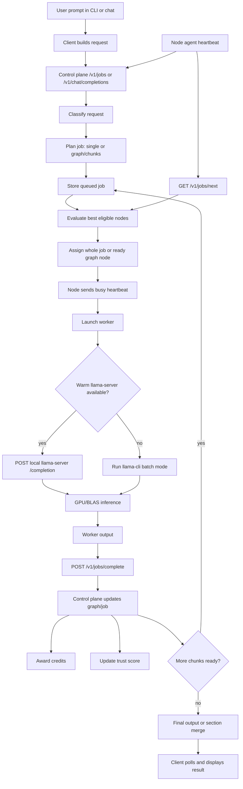

# MundusX Computations, Components, And Request Flow

This document summarizes the current MundusX control-plane and CLI behavior, plus the recommended Markdown skills layer for improving routing, formatting, tool use, and multi-step planning.

## Core Computations

### CLI Default Max Tokens

When a user does not pass `--max-tokens`, the CLI chooses a budget from the prompt shape:

| Prompt type | Default max tokens |
| --- | ---: |
| Short arithmetic or compact computation | 4 |
| `one word`, `one number`, `answer only`, `final number` | 16 |
| Complete/full program or source-code request | 2048 |
| Long-form history, report, overview, detailed explanation | 768 |
| Default fallback | 128 |

### Worker Context Size

The worker estimates a llama context window that can hold the prompt plus generated output:

```text
prompt_token_estimate = max(prompt_chars / 3, 32)
needed_context = prompt_token_estimate + max_tokens + 256
context = clamp(needed_context, 1024, 4096)
```

This is intentionally conservative for low-VRAM GPUs.

### Credit Scoring

Current credit scoring is character-based, not true token-metered accounting:

```text
work_units = ceil((prompt_chars + output_chars) / 400)
credits = round(work_units, 2)
```

Example:

```text
prompt_chars = 23
output_chars = 835

work_units = ceil((23 + 835) / 400)
           = ceil(858 / 400)
           = 3

credits = 3.00
```

`400` is the current character work-unit divisor.

`contribution_percent` is not a payout multiplier. It is a routing budget cap used
to decide how much work a contributor allows MundusX to schedule on that device,
and it may influence model/workload eligibility. Credits are awarded for completed
work, not for the configured contribution cap.

### Node Trust Score

Nodes start around `50`. Trust is adjusted by completed and failed work:

```text
score = 50
+ completed_jobs * 2, max 20 jobs
- failed_jobs * 5, max 20 jobs
- consecutive_failures * 4, max 10 failures
+ accepted_results * 2, max 20
- rejected_results * 4, max 20
score = clamp(score, 0, 100)
```

### Control-Plane Scheduler Score

The control-plane scheduler scores only eligible nodes. Eligibility requires:

- node state is `ready`
- policy is allowed
- backend matches the job request
- worker health is healthy
- runtime is ready
- `llama-cli` or persistent runtime is available
- requested model matches when a model is explicitly requested
- stream support exists when streaming is required

Current score inputs include:

| Signal | Example effect |
| --- | --- |
| Coding task on CUDA | `+20` |
| Document/chat task on M-series | `+15` |
| M-series eligible | `+10` |
| CUDA eligible | `+8` |
| Auto backend fallback | `+2` |
| Small context | `+3` |
| Medium/large context | memory-derived bonus |
| Available GPU | `available_gpu_percent / 10`, capped at `+10` |
| Sensitive request on trusted identity path | `+15` |
| Public/internal privacy fit | `+5` |
| Requested model already present | `+20` |
| Streaming capable | `+3` |
| Runtime dependencies ready | `+5` |
| Trust bonus | `trust_score / 5 - 10` |

### Model Tier Routing

Model names are mapped into rough tiers:

| Tier | Examples |
| --- | --- |
| Tiny | `135m`, `0.1b`, `0.2b`, `tiny`, `smollm` |
| Small | `0.5b`, `500m`, `0_5b` |
| Strong | `3b`, `4b`, `7b`, `8b`, `14b`, `32b` |
| Normal | fallback |

Routing preference:

- simple, latency-sensitive jobs prefer tiny/small models
- long, code, sectioned, or graph jobs prefer normal/strong models
- tiny/small models are penalized for long or code work

### Recent Chunk Performance

The scheduler also uses recent graph-node performance:

```text
average chunk latency 0-15s       -> +18
average chunk latency 15-30s      -> +10
average chunk latency 30-60s      -> +2
average chunk latency 60-120s     -> -12
average chunk latency over 120s   -> -24
```

Recent chunk failures apply a penalty:

```text
failure_penalty = min(failed_samples, 5) * 12 * latency_weight
```

Long-running stages and reducers use a higher latency weight.

### Reducer Profile

Reducer/final synthesis uses node profiles:

| Profile | Criteria |
| --- | --- |
| Strong | M-series with BLAS, or CUDA with driver/device ready and at least 30% GPU available |
| Compact | unhealthy node, low-VRAM CUDA note, or GTX 1050/1060/1650/1660 |
| Standard | healthy fallback profile |

Reducer score adjustments:

```text
Strong reducer   -> +35
Standard reducer -> +8
Compact reducer  -> -10
```

If a compact node cannot safely synthesize the final response, the control plane can fall back to deterministic merging of completed sections.

### Timeouts And Leases

Current defaults:

```text
node heartbeat stale timeout = 60s
queued job no-worker timeout = 600s
graph chunk lease timeout = 600s
graph node max attempts = 3
```

## Control-Plane Components

### `apps/control-plane/src/main.rs`

Rust HTTP server and operator UI.

Responsibilities:

- serve `/health`
- serve `/v1/status`
- accept `/v1/register`
- accept `/v1/heartbeat`
- accept `/v1/jobs`
- assign `/v1/jobs/next`
- accept `/v1/jobs/complete`
- expose `/v1/credits`
- render `/jobs`, `/nodes`, `/credits`, and job detail pages

### `apps/control-plane/src/state.rs`

Main control-plane brain.

Responsibilities:

- node registry
- heartbeat state
- policy application
- job submission
- deterministic request classification
- job planning and graph construction
- scheduler scoring
- job claim assignment
- graph node execution state
- stale node maintenance
- graph-node retry and lease handling
- completion processing
- trust scoring
- credit award calculation

### `apps/control-plane/src/contracts.rs`

Shared Rust contract types.

Important records:

- `NodeRecord`
- `JobRecord`
- `JobGraph`
- `JobGraphNode`
- `Heartbeat`
- `AgentRegistration`
- `JobRequest`
- `JobCompletion`
- `SchedulerDecision`
- `CreditsLedgerRecord`
- `WorkerHealthReport`

### `apps/control-plane/src/supabase.rs`

Supabase persistence and restore layer.

Responsibilities:

- read/write nodes
- read/write jobs
- read/write job events
- read/write credit ledger entries
- sync chat messages where enabled
- handle HTTP response parsing

### `apps/control-plane/src/migrations.rs`

Schema and migration support.

### `apps/dashboard/src/main.js`

Operator dashboard frontend.

Responsibilities:

- overview metrics
- node topology
- node details
- jobs view
- credits view
- policy/runtime readiness display

### `apps/chat/src/main.js`

MundusX Chat service and UI.

Responsibilities:

- chat interface
- conversation history
- tool routing for weather/facts/persona-style responses
- chat request handling
- formatting and display

## CLI And Node Components

### `apps/cli/src/main.rs`

Main `opengpu` CLI.

Responsibilities:

- `opengpu install`
- `opengpu start`
- `opengpu run`
- `opengpu jobs submit/status/wait`
- `opengpu model download/activate/import/list`
- `opengpu cap`
- `opengpu credits`
- `opengpu login/logout`
- `opengpu onboarding`
- `opengpu disconnect/exit`

### `apps/cli/src/config.rs`

Local user and machine config.

Stores:

- control-plane URL
- backend preference
- active model
- model directory
- contribution percent
- connected/paused state
- onboarding state

### `apps/cli/src/identity.rs`

Device identity support.

On Windows, the private key material is DPAPI-protected. The public key and fingerprint are reported to the control plane.

### `apps/cli/src/model.rs`

Model cache and lifecycle.

Responsibilities:

- download official models
- import local GGUF models
- activate selected model
- maintain model manifest
- avoid stale active-model confusion

### `apps/cli/src/model_catalog.rs`

Official model catalog and compatibility checks.

### `apps/cli/src/routing.rs`

Older/simple local routing score used by CLI-side tests and demos. Real production scheduling happens in the control plane.

### `agents/node/src/main.rs`

Node agent.

Responsibilities:

- register node
- send heartbeat
- advertise capabilities
- claim jobs
- send busy heartbeat
- launch worker
- send completion
- send ready/paused heartbeat
- start and stop persistent runtime

### `agents/node/src/worker.rs`

Local inference worker.

Responsibilities:

- locate active GGUF model
- verify trusted `llama-cli`
- verify `llama-server`
- probe CUDA/BLAS
- probe power state
- start persistent runtime
- run request through warm `llama-server` when available
- fall back to `llama-cli` batch mode
- return output, runtime mode, backend, model, and worker metadata

### `agents/node/src/http.rs`

Signed HTTP client for control-plane communication.

### `agents/node/src/storage.rs`

Agent config, local state, and heartbeat log storage.

### `agents/node/src/identity.rs`

Loads device identity and signs requests.

## Request Flow



## Chunking Behavior

### Single Job

```text
one prompt -> one job -> one node -> one worker result
```

### Sectioned Research

Used for prompts such as detailed history, overview, report, analysis, timeline:

```text
Origins and founders
Early development
Expansion and milestones
Modern era
```

These sections can be returned directly. Final synthesis is optional depending on plan shape.

### Complete Code Generation

Used for complete/full program requests:

```text
Code contract
Structs, constants, and prototypes
Binary write functions
Binary search and read functions
Input and display helpers
Main menu and demo flow
Compile and usage notes
Final answer
```

### Code With Explanation

Used for smaller code requests that also ask for explanation:

```text
Complete source
Explanation
```

### Responsibility-Based Work

Used for broad implementation-style prompts:

```text
Scope and constraints
Backend implementation
Frontend implementation
Security review
Documentation
Regression tests
Final synthesis
```

## Current Limitation

The current planner is deterministic heuristic logic. It is not yet a live AI planner.

That means it can still misclassify vague prompts and create awkward chunks. The scheduler and graph execution are real, but planning quality is still rule-based.

The next major improvement is an intelligent planner/verifier layer that decides:

```text
Is this math/tool/direct?
Is this code?
Is this factual lookup?
Is this multi-intent?
Should it split?
How many chunks?
Which chunks can run in parallel?
Which chunk must wait?
Which node quality is required?
```

## Recommended Markdown Skills Layer

The recommended next layer is a Markdown skill system plus deterministic router.

Suggested structure:

```text
docs/skills/
  router.md
  math.md
  code.md
  weather.md
  facts.md
  persona-atlas.md
  formatter.md
  chunk-planner.md
  verifier.md
```

### Skill Routing Flow

```text
User prompt
-> deterministic router checks intent
-> select one or more Markdown skills
-> build system prompt from selected skills
-> decide tool vs LLM vs chunking
-> execute
-> formatter/verifier cleans result
-> return to UI/CLI
```

Example:

```text
"weather in Berlin and tell me your name"

Router selects:
- weather.md
- persona-atlas.md
- formatter.md

Execution:
1. weather uses wttr.in
2. persona answers the name
3. formatter combines both cleanly
```

### Example Skill: Persona

```md
# Atlas Persona Skill

You are Atlas, the MundusX assistant.

Answer direct identity questions briefly.

Rules:
- If asked "what is your name", answer: "My name is Atlas."
- If asked "who created you", answer: "I was built by the MundusX open-source team."
- Do not ask follow-up questions unless needed.
- Do not explain your role unless the user asks.
- Do not echo the user's question.
```

### Example Skill: Math

```md
# Math Skill

Use this skill for arithmetic, algebra, derivatives, integrals, and equations.

Rules:
- Solve directly.
- Show steps only when useful.
- For short validation questions, answer first.
- Do not use long prose.
- Use Markdown math formatting.
```

### Example Skill: Code

```md
# Code Generation Skill

Use this skill when the user asks for a program, function, source file, CLI app, or implementation.

Rules:
- Return complete compilable code when requested.
- Use fenced code blocks with language labels.
- Do not rewrite or complete the user's prompt.
- Do not include placeholder code unless the user asks for outline only.
- If explanation is needed, put it after the code.
```

### Router Output Shape

The router should produce structured routing metadata:

```json
{
  "intents": ["code"],
  "skills": ["code.md", "formatter.md"],
  "execution_mode": "decompose",
  "chunk_plan": ["complete_source", "explanation"],
  "tools": []
}
```

### Routing Rule

Do not send every prompt directly to the LLM.

Route first:

```text
weather -> tool
simple math -> deterministic math/rules
facts/current info -> facts/wiki/web tool
identity/persona -> persona skill
code -> code skill + optional chunking
long research -> chunk planner
```

This gives Atlas more stable behavior without hardcoding every answer in Rust.
