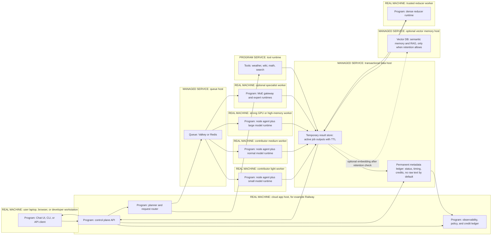

# Small Production Architecture Flow

This diagram shows the complete request and result path for small production. Outer boxes are real machines or managed services. Inner boxes are processes or data components running inside that machine or service.

## Reading Guide

- `REAL MACHINE` means physical or virtual hardware.
- `MANAGED SERVICE` means hosted infrastructure such as Postgres, Supabase, Valkey, Redis, or a vector database.
- `PROGRAM SERVICE` means a software service that can run on the control-plane host or a separate small host.
- `Temporary result store` keeps active job and chunk outputs so workers, reducers, and the UI can coordinate. Raw text should have TTL cleanup by default.
- `Permanent metadata ledger` keeps job status, node IDs, timing, queue data, credits, and audit metadata. It should not store raw prompts or outputs by default.
- `Vector DB` is optional memory/RAG storage. It is not the execution ledger and should only receive data allowed by retention policy.
- The reducer is not the end of the flow. It writes the final answer back to the temporary result store, then the control plane returns the answer to the client.
